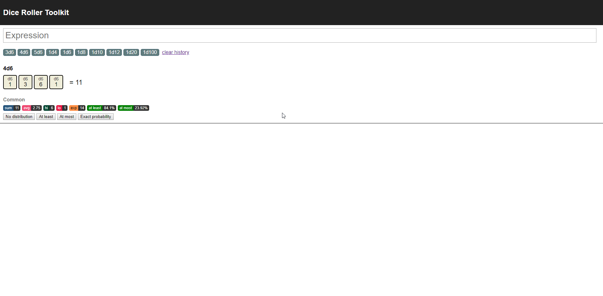

# Dice Roller Toolkit



## Quick start

This project was kickstarted using [create-react-app with TypeScript](https://github.com/Microsoft/TypeScript-React-Starter). You need node installed to run it. To get started in development mode, clone this repository and cd into the directory. Then run:

```shell
npm install
npm start
```

This will expose the dice-roller on port 3000.

### Docker

There is also a dockerfile included. If you have docker installed, you can run:

```shell
npm run build-docker
docker run -it -p 5000:5000 dice-roller
```

This will expose the dice-roller on port 5000.